# A Diagrammatic Guide to URL Loading System and Data Fetching in iOS
> This content is dual-licensed under your choice of the following licenses:
> 1.  **MIT License:** For the code implementations in Swift and Mermaid provided in this document.
> 2.  **Creative Commons Attribution 4.0 International License (CC BY 4.0):** For all other content, including the text, explanations, and the Mermaid diagrams and illustrations.

----
## Note: These diagrams needed to be rendered on a macOS machine to properly reflect the color system and Mermaid syntax code as intended to convey.
----
This document provides a collection of diagrams and illustrations, created using Mermaid syntax, to comprehensively explain the technical concepts of Apple's URL Loading System and fetching website data into memory. It is based on the official Apple documentations provided and enhances the existing diagrams to offer a more detailed and integrated understanding.

You can check out the sub-version of this comprehensive diagrammatic guide at these documentation: 
- [Fetching Website data into memory](/WEB_TECH/Fetching_website_data_into_memory/Fetching_website_data_into_memory_V1.md)
- [URL Loading System](/WEB_TECH/URL_Loading_System/URL_Loading_System_V1.md)

---

## 1. Integrated Class Diagram: URL Loading System Core Components

This enhanced class diagram integrates and expands upon the previous diagrams to depict the core components of the URL Loading System, their attributes, methods, and relationships in greater detail.

```mermaid
---
title: Integrated Core Components Class Diagram - URL Loading System
config:
  look: handDrawn
  theme: dark
---
classDiagram
    direction BT
    class URLSession {
        +configuration: URLSessionConfiguration
        +delegate: URLSessionDelegate?
        +delegateQueue: OperationQueue
        +sessionDescription: String?
        +isDiscretionary: Bool
        --
        +shared: URLSession (static)
        --
        +dataTask(with: URLRequest, completionHandler) : URLSessionDataTask
        +downloadTask(with: URL, completionHandler) : URLSessionDownloadTask
        +uploadTask(with: URLRequest, from: Data?, completionHandler) : URLSessionUploadTask
        +streamTask(with: Host, port) : URLSessionStreamTask
        +webSocketTask(with: URL) : URLSessionWebSocketTask
        +invalidateAndCancel()
        +finishTasksAndInvalidate()
        +reset(completionHandler)
        +getAllTasks(completionHandler: @escaping ([URLSessionTask]) -> Void)
        +... task creation & management methods
    }
    class URLSessionConfiguration {
        +identifier: String?
        +requestCachePolicy: URLRequest.CachePolicy
        +timeoutIntervalForRequest: TimeInterval
        +timeoutIntervalForResource: TimeInterval
        +allowsCellularAccess: Bool
        +waitsForConnectivity: Bool
        +isDiscretionary: Bool
        +protocolClasses: [AnyClass]?
        +connectionProxyDictionary: [AnyHashable : Any]?
        +httpAdditionalHeaders: [AnyHashable : Any]?
        +urlCache: URLCache?
        +httpCookieStorage: HTTPCookieStorage?
        +urlCredentialStorage: URLCredentialStorage?
        +networkServiceType: NetworkServiceType
        +multipathServiceType: MultipathServiceType
        +allowsExpensiveNetworkAccess: Bool
        +allowsConstrainedNetworkAccess: Bool
        +shouldUseExtendedBackgroundIdleMode: Bool
        +sessionSendsLaunchEvents: Bool
        +isSharedContainerIdentifierGroupIdentifier: String?

        --
        +static default: URLSessionConfiguration
        +static ephemeral: URLSessionConfiguration
        +static background(withIdentifier: String): URLSessionConfiguration
        --
    }
    class URLSessionTask {
        <<abstract>>
        +taskIdentifier: Int
        +taskDescription: String?
        +originalRequest: URLRequest?
        +currentRequest: URLRequest?
        +response: URLResponse?
        +error: Error?
        +state: URLSessionTaskState
        +priority: Float
        +progress: Progress

        --Metrics--
        +countOfBytesClientExpectedToSend: Int64
        +countOfBytesClientSent: Int64
        +countOfBytesExpectedToReceive: Int64
        +countOfBytesReceived: Int64
        --
        +resume()
        +suspend()
        +cancel()
    }
    class URLSessionDataTask {
        <<concrete>>
    }
    class URLSessionDownloadTask {
        <<concrete>>
    }
    class URLSessionUploadTask {
        <<concrete>>
    }
    class URLSessionStreamTask {
        <<concrete>>
    }
    class URLSessionWebSocketTask {
        <<concrete>>
    }
    class URLSessionDelegate {
        <<interface>>
        +urlSession(_:didBecomeInvalidWithError:)
        +urlSessionDidFinishEvents(forBackgroundURLSession:)
        +urlSession(_:configuration:did становятсяInvalidWithError:)
        +... session-level events
    }
    class URLSessionTaskDelegate {
        <<interface>>
        +urlSession(_:task:willPerformHTTPRedirection:...)
        +urlSession(_:task:didReceive:challenge:...)
        +urlSession(_:task:needNewBodyStream:)
        +urlSession(_:task:didSendBodyData:...)
        +urlSession(_:task:didFinishCollectingMetrics:)
        +urlSession(_:task:countOfBytesClientExpectedToSendDidChange:)
        +urlSession(_:task:countOfBytesClientSentDidChange:)
        +urlSession(_:task:countOfBytesExpectedToReceiveDidChange:)
        +urlSession(_:task:countOfBytesReceivedDidChange:)
        +urlSession(_:task:didCompleteWithError:)
        +... task lifecycle & control events
    }
    class URLSessionDataDelegate {
        <<interface>>
        +urlSession(_:dataTask:didReceive:response:completionHandler:)
        +urlSession(_:dataTask:didBecomeStreamTask:)
        +urlSession(_:dataTask:didReceive:)
        +urlSession(_:dataTask:willCacheResponse:completionHandler:)
        +... data delivery & response events
    }
    class URLSessionDownloadDelegate {
        <<interface>>
        +urlSession(_:downloadTask:didFinishDownloadingTo:)
        +urlSession(_:downloadTask:didWriteData:totalBytesWritten:totalBytesExpectedToWrite:)
        +urlSession(_:downloadTask:didResumeAtOffset:expectedTotalBytes:)
        +urlSession(_:downloadTask:didCreateSandboxFolder:)
        +... download task specific events
    }

    URLSession "1" *-- "1" URLSessionConfiguration : configuration
    URLSession "1" o-- "0..1" URLSessionDelegate : delegate
    URLSession "1" *-- "*" URLSessionTask : tasks
    URLSessionTask <|-- URLSessionDataTask : <creates>
    URLSessionTask <|-- URLSessionDownloadTask : <creates>
    URLSessionTask <|-- URLSessionUploadTask : <creates>
    URLSessionTask <|-- URLSessionStreamTask : <creates>
    URLSessionTask <|-- URLSessionWebSocketTask : <creates>

    URLSessionDelegate <.. URLSession : uses
    URLSessionDelegate <|-- URLSessionTaskDelegate : specializes
    URLSessionDelegate <|-- URLSessionDataDelegate : specializes
    URLSessionDelegate <|-- URLSessionDownloadDelegate : specializes
    URLSessionTaskDelegate <|-- URLSessionDataDelegate : specializes
    URLSessionTaskDelegate <|-- URLSessionDownloadDelegate : specializes


    note for URLSession "Entry point to the URL Loading System.<br>Manages tasks, configurations, and delegates. Supports various task types."
    note for URLSessionConfiguration "Configures session behavior comprehensively: caching, timeouts, network access, security policies, proxies, cookies, and more.<br>Key Types: default, ephemeral, background.<br>Essential for customizing session behavior."
    note for URLSessionTask "Abstract base class for all network operations.<br>Manages task lifecycle (resume, suspend, cancel), state, priority, progress monitoring, and request/response data.<br>Foundation for Data, Download, Upload, Stream, and WebSocket Tasks."
    note for URLSessionDelegate "Interface to receive session-level events and task completion callbacks.<br>Enables custom handling of authentication challenges, redirections, and session invalidation.<br>Basis for more specialized delegates."
    note for URLSessionDataTask "Specialized task for retrieving data directly into memory.<br>Efficient for API calls and handling small to medium-sized data responses.<br>Uses completion handlers or delegates for result delivery."
    note for URLSessionDownloadTask "Task designed for downloading files to the local file system.<br>Supports background downloads and resuming interrupted downloads.<br>Optimized for large file transfers and background operations."
    note for URLSessionUploadTask "Handles uploading data or files to servers.<br>Supports various upload methods including file-based and streamed requests.<br>Crucial for applications requiring content upload."
    note for URLSessionStreamTask "Enables bidirectional communication over TCP/IP connections.<br>For custom protocols or real-time data streams.<br>Provides fine-grained control over data flow."
    note for URLSessionWebSocketTask "Implements WebSocket protocol for full-duplex communication.<br>For real-time, persistent connections with servers.<br>Supports message-based data exchange."
    note for URLSessionDataDelegate "Delegate protocol specialized for data tasks.<br>Extends URLSessionTaskDelegate to include methods for handling received data and caching policies.<br>Key for delegate-based data task management."
    note for URLSessionDownloadDelegate "Delegate protocol specialized for download tasks.<br>Extends URLSessionTaskDelegate to manage file downloads, track progress, and handle download completion and resumption."
    note for URLSessionTaskDelegate "Delegate protocol extending URLSessionDelegate for task-level events.<br>Manages task-specific actions like redirection, authentication, and data sending progress.<br>Base for Data and Download Delegates."
    
```

---

## 2. Enhanced Task Execution Flow Diagram

This flowchart details the lifecycle of a `URLSessionTask` from creation to completion, emphasizing the asynchronous nature of network operations and the different task states.

Here is the example of this diagram when render on a macOS machine look like: 

---

## 3. Detailed Sequence Diagram: Completion Handler Flow for Data Task

This sequence diagram provides a more granular view of the data task completion handler process, including detailed steps for error checking, response validation, and data processing.

Here is another version of this diagram.

---

## 4. Detailed Sequence Diagram: Delegate Flow for Data Task

This sequence diagram breaks down the delegate-based approach for data tasks, illustrating the sequence of delegate method calls and the flow of data chunks as they are received.

Here is another version of this diagram.

---

## 5. Comparison Table: Completion Handler vs. Delegate Approaches

This enhanced comparison table provides a clearer differentiation between completion handlers and delegates, highlighting when to use each approach based on complexity, control, and use cases.

| Feature                     | Completion Handler                                   | Delegate                                                                     |
| :-------------------------- | :--------------------------------------------------- | :--------------------------------------------------------------------------- |
| **Setup Complexity**        | Very Simple: Closure-based, minimal setup             | More Complex: Requires session creation, delegate implementation, protocol conformance |
| **Control Granularity**     | Low: Limited control, primarily at task completion   | High: Fine-grained control at every stage, event-driven progress & error handling |
| **Event Handling Scope**     | End-of-Transfer: Handles final results (data, response, error) | Comprehensive: Handles numerous events (progress updates, data chunks, redirects, authentication challenges, errors) |
| **Data Delivery**          | All at Once: Receives complete data after transfer    | Chunked: Receives data progressively as it arrives, efficient for large data |
| **Ideal Use Cases**         | Simple, Quick Requests: Basic API interactions, fire-and-forget requests, non-critical background data fetches | Complex, Interactive Tasks: Background downloads/uploads, UI requiring progress display, advanced network protocol handling, custom authentication |
| **Error Management Detail** | Basic Error Reporting: Error at completion only        | Detailed Error Handling: Comprehensive reporting throughout task lifecycle |
| **Code Organization**       | Closure-Centric: Can lead to nested closures, less structured for complex tasks | Delegate-Centric: Delegate methods promote modular, organized, event-driven code |
| **Memory Efficiency**       | Good for One-Shot Retrieval: Simpler memory management for single data retrieval | Requires Buffer Management: Need to manage data buffers when accumulating received data chunks |
| **Performance Overhead**     | Minimal Overhead: Slightly less runtime overhead      | Moderate Overhead: Delegate method calls introduce some overhead, but offer richer functionality |
| **Testability**             | Can be Less Testable: Testing nested closure logic can be intricate | More Testable: Delegate methods are easier to mock and test in isolation |
| **Best Suited For**         | **Simple, straightforward network requests**          | **Complex, event-rich network operations requiring fine control and detailed handling** |

---

## 6. Expanded Mind Map: Background URLSession in Detail

This expanded mind map provides a more detailed breakdown of the Background URLSession, covering key aspects such as configuration nuances, delegate responsibilities, and practical considerations.

---
**Licenses:**

- **MIT License:**   - Full text in [LICENSE](LICENSE) file.
- **Creative Commons Attribution 4.0 International:**  - Legal details in [LICENSE-CC-BY](LICENSE-CC-BY) and at [Creative Commons official site](http://creativecommons.org/licenses/by/4.0/).

---