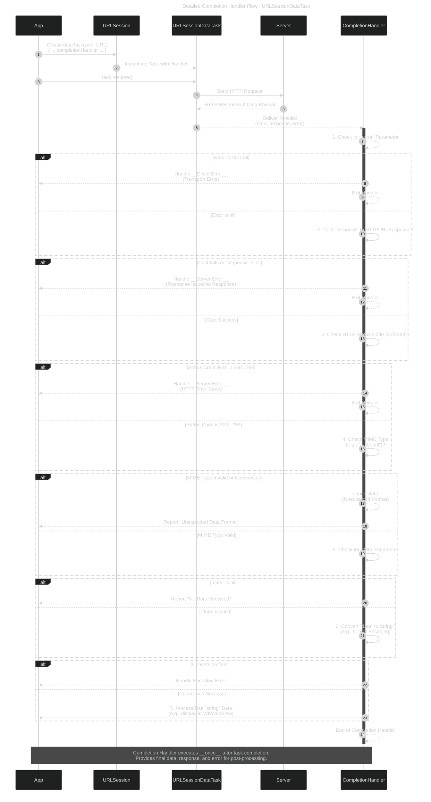
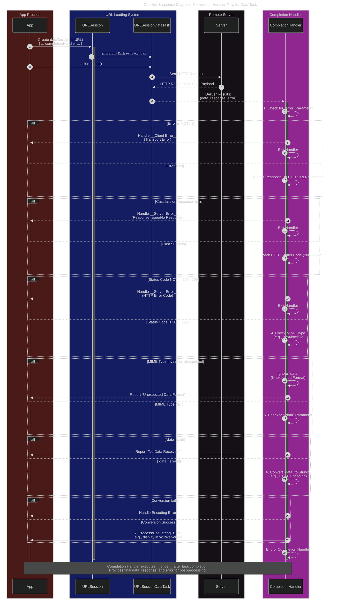
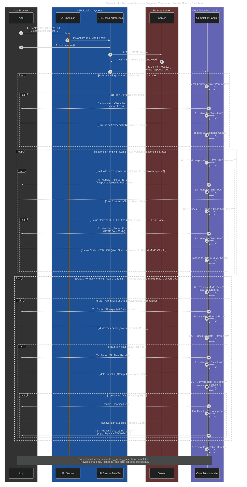
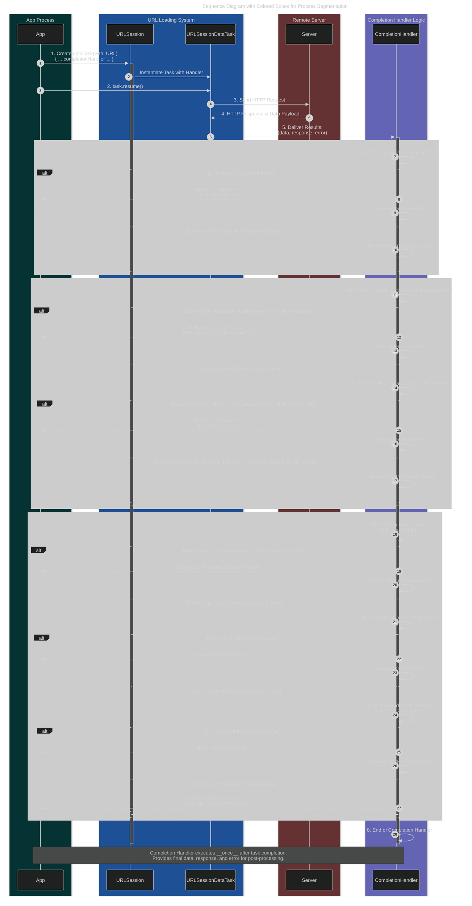

# A Diagrammatic Guide to URL Loading System and Data Fetching in iOS
> This content is dual-licensed under your choice of the following licenses:
> 1.  **MIT License:** For the code implementations in Swift and Mermaid provided in this document.
> 2.  **Creative Commons Attribution 4.0 International License (CC BY 4.0):** For all other content, including the text, explanations, and the Mermaid diagrams and illustrations.

----
## Note: These diagrams needed to be rendered on a macOS machine to properly reflect the color system and Mermaid syntax code as intended to convey.

Below are different syntax to render the diagram from section `Detailed Sequence Diagram: Completion Handler Flow for Data Task`, indended to syntax refernces.

----

## 3. Detailed Sequence Diagram: Completion Handler Flow for Data Task

This sequence diagram provides a more granular view of the data task completion handler process, including detailed steps for error checking, response validation, and data processing.

Here is another version of this diagram.

and another version of this diagram with more color segmentations.

```mermaid
---
title: Detailed Sequence Diagram - Completion Handler Flow for Data Task
config:
  look: handDrawn
  theme: dark
---
sequenceDiagram
    autonumber
    box rgb(73, 26, 23) App Process
    participant App
    end

    box rgb(20, 28, 98) URL Loading System
    participant URLSession
    participant URLSessionDataTask
    end

    box rgb(21, 16, 21) Remote Server
    participant Server
    end

    box rgb(144, 38, 144) Completion Handler
    participant CompletionHandler
    end


    App->>+URLSession: Create dataTask(with: URL)<br>{ ... completionHandler ... }
    activate URLSession
    URLSession->>URLSessionDataTask: Instantiate Task with Handler
    App->>URLSessionDataTask: task.resume()
    URLSessionDataTask->>Server: Send HTTP Request
    Server-->>URLSessionDataTask: HTTP Response & Data Payload

    URLSessionDataTask-->>+CompletionHandler: Deliver Results:<br>(data, response, error)
    activate CompletionHandler
    CompletionHandler->>CompletionHandler: 1. Check for `error` Parameter
    rect rgb(32, 8, 55)
    alt Error is NOT nil
        rect rgb(82, 88, 123)
            CompletionHandler-->>App: Handle __Client Error__<br>(Transport Error)
            CompletionHandler->>CompletionHandler: Exit Handler
        end
    else Error is nil
        rect rgb(92, 104, 55)
            CompletionHandler->>CompletionHandler: 2. Cast `response` to HTTPURLResponse?
        end
    end

    alt Cast fails or `response` is nil
        rect rgb(20, 44, 5)
            CompletionHandler-->>App: Handle __Server Error__<br>(Response Issue/No Response)
            CompletionHandler->>CompletionHandler: Exit Handler
        end
    else Cast Success
        rect rgb(72, 74, 35)
            CompletionHandler->>CompletionHandler: 3. Check HTTP Status Code (200-299)?
        end
    end

    alt Status Code NOT in 200...299
        rect rgb(20, 52, 55)
            CompletionHandler-->>App: Handle __Server Error__<br>(HTTP Error Code)
            CompletionHandler->>CompletionHandler: Exit Handler
        end
    else Status Code is 200...299
        rect rgb(62, 64, 665)
            CompletionHandler->>CompletionHandler: 4. Check MIME Type<br>(e.g., "text/html")?
        end
    end

    alt MIME Type Invalid or Unexpected
        rect rgb(92, 44, 55)
            CompletionHandler->>CompletionHandler: Ignore `data`<br>(Unexpected Format)
            CompletionHandler-->>App: Report "Unexpected Data Format"
        end
    else MIME Type Valid
        rect rgb(92, 14, 15)
            CompletionHandler->>CompletionHandler: 5. Check for `data` Parameter
        end
    end

     alt `data` is nil
        rect rgb(62, 4, 55)
            CompletionHandler-->>App: Report "No Data Received"
        end
    else `data` is valid
        rect rgb(32, 84, 55)
            CompletionHandler->>CompletionHandler: 6. Convert `data` to String?<br>(e.g., UTF-8 Encoding)
        end 
    end

    alt Conversion fails
        rect rgb(92, 84, 55)
            CompletionHandler-->>App: Handle Encoding Error
        end
    else Conversion Success
        rect rgb(32, 14, 55)
            CompletionHandler->>App: 7. Process/Use `string` Data <br>(e.g., display in WKWebView)
        end
    end
    end

    CompletionHandler-->>CompletionHandler: End of Completion Handler
    deactivate CompletionHandler
    deactivate URLSession


    Note over App,CompletionHandler: Completion Handler executes __once__ after task completion.<br> Provides final data, response, and error for post-processing.
    
```

Another version of this diagram:

----

### This is an extra section for this diagram

Here's the sequence diagram redrawn to emphasize the different processes within the Completion Handler using rectangular boxes of different colors. This should visually segment the error handling, response validation, and data processing stages.

In this version:

- I've used `rect rgb(r, g, b)` to define colored boxes around each major processing stage within the `CompletionHandler`.
- **Error Handling** is in a light beige (`rgb(220, 220, 200)`).
- **Response Handling** is in a light green (`rgb(200, 230, 200)`).
- **Data & Format Handling** is in a light blue (`rgb(200, 200, 230)`).

These color cues should help to visually separate and understand the different phases within the completion handler's execution flow, making the diagram easier to interpret in terms of process segmentation.

---
**Licenses:**

- **MIT License:**   - Full text in [LICENSE](LICENSE) file.
- **Creative Commons Attribution 4.0 International:**  - Legal details in [LICENSE-CC-BY](LICENSE-CC-BY) and at [Creative Commons official site](http://creativecommons.org/licenses/by/4.0/).

---