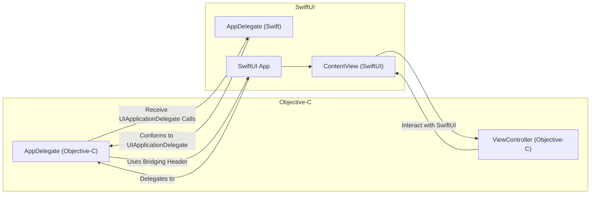

# Objective-C and Swift Integration Diagram

> This content is dual-licensed under your choice of the following licenses:
> 1.  **MIT License:** For the code implementations in Swift and Mermaid provided in this document.
> 2.  **Creative Commons Attribution 4.0 International License (CC BY 4.0):** For all other content, including the text, explanations, and the Mermaid diagrams and illustrations.

---

To fully grasp how **Objective-C components** integrate with **SwiftUI and Swift**, this diagram highlights the **interaction and bridging mechanisms** between Objective-C and Swift within the app lifecycle.

### Integration Points Explained:

1. **Bridging Header:**
    - **Bridging Header:** Allows Objective-C and Swift code to coexist within the same project. Essential for integrating Objective-C `AppDelegate` with SwiftUI's `App` protocol.
2. **AppDelegate Bridging:**
    - **`AppDelegateObjC` (Objective-C):** Traditionally manages application lifecycle events.
    - **`AppDelegateSwift` (SwiftUI):** SwiftUI’s `App` protocol often replaces the need for an Objective-C `AppDelegate`, but when integrating, the Objective-C `AppDelegate` can conform or interact with SwiftUI’s application responsibilities.
3. **View Controllers Interaction:**
    - **`ViewControllerObjC` (Objective-C):** View controllers written in Objective-C can interact with SwiftUI views (`ContentView`) through coordination patterns or hosting controllers.
4. **Lifecycle Communication:**
    - **UIApplicationDelegate Calls:** Regardless of SwiftUI or Objective-C implementations, lifecycle events are routed through the `AppDelegate`, ensuring centralized management.
5. **SwiftUI App Delegation:**
    - **`SwiftUIApplication` (SwiftUI App):** Utilizes SwiftUI’s `App` protocol but can delegate responsibilities to the Objective-C `AppDelegate` for handling legacy or specific functionalities.

### Key Points:

- **Coexistence:** Objective-C and Swift can coexist within the same project, allowing gradual migration or leveraging existing Objective-C codebases alongside new SwiftUI components.
- **Hosting Controllers:** When integrating SwiftUI views (`ContentView`) within Objective-C view controllers, `UIHostingController` facilitates this interaction, enabling SwiftUI components to be embedded within UIKit-based view hierarchies.
- **Delegation Patterns:** Communication between Objective-C view controllers and SwiftUI views can be managed through delegation, notifications, or shared data models, ensuring seamless interaction across frameworks.

---

## Integrating the Diagrams

To understand the full scope of the iOS application lifecycle incorporating Objective-C components alongside UIKit and SwiftUI, it's essential to see how these diagrams interconnect:

1. **Application Lifecycle ↔ Objective-C Integration:**
    - The **High-Level Application Lifecycle Diagram** now includes Objective-C `UIApplicationDelegate` methods, illustrating how lifecycle events are handled within Objective-C.
2. **Objective-C and Swift Integration ↔ SwiftUI Lifecycle:**
    - **Objective-C components** such as `AppDelegateObjC` interact with **SwiftUI's `SwiftUIApplication`**, ensuring that lifecycle events are appropriately managed across both frameworks.
    - **View Controllers** in Objective-C can host SwiftUI views (`ContentView`) via `UIHostingController`, bridging UIKit view hierarchies with SwiftUI's declarative views.
3. **SwiftUI Scene Phase ↔ Application Lifecycle:**
    - **SwiftUI's scene phases** detect and respond to the broader application lifecycle states managed by UIKit and Objective-C, ensuring that SwiftUI views update appropriately as the app transitions between active, inactive, background, and suspended states.
4. **SwiftUI View Lifecycle ↔ Objective-C Interaction:**
    - SwiftUI's view lifecycle events (`onAppear`, `onDisappear`) are influenced by interactions with Objective-C view controllers, ensuring smooth transitions and state management across views.

### Flow Example: App Launch

1. **Launch:**
    - **High-Level Lifecycle:** `[ * ]` ➔ `NotRunning` ➔ `Inactive`
    - **Objective-C Integration:** `AppDelegateObjC` handles `application:didFinishLaunchingWithOptions:`
    - **SwiftUI Scene Phase:** `SwiftUIApplication` initializes and transitions to `ActiveSwiftUI`
    - **SwiftUI View Lifecycle:** `ContentView.onAppear()` is triggered
2. **Interrupt (e.g., Incoming Call):**
    - **High-Level Lifecycle:** `Active` ➔ `Inactive`
    - **Objective-C Integration:** `AppDelegateObjC` handles `applicationWillResignActive:`
    - **SwiftUI Scene Phase:** `ActiveSwiftUI` ➔ `InactiveSwiftUI`
    - **SwiftUI View Lifecycle:** `ContentView.onDisappear()` is triggered
3. **Move to Background:**
    - **High-Level Lifecycle:** `Inactive` ➔ `Background`
    - **Objective-C Integration:** `AppDelegateObjC` handles `applicationDidEnterBackground:`
    - **SwiftUI Scene Phase:** `InactiveSwiftUI` ➔ `BackgroundSwiftUI`
    - **SwiftUI View Lifecycle:** `ContentView.onDisappear()` (if applicable)
4. **Terminate:**
    - **High-Level Lifecycle:** `Background` ➔ `NotRunning`
    - **Objective-C Integration:** `AppDelegateObjC` handles `applicationWillTerminate:`
    - **SwiftUI Scene Phase:** App transitions to `[ * ]`
    - **SwiftUI View Lifecycle:** N/A (App is terminating)

----

## Benefits of Integrating Objective-C into the Diagrams

- **Comprehensive Understanding:** Provides insight into how Objective-C and Swift coexist, ensuring legacy code can be maintained alongside new SwiftUI components.
- **Clear Bridging Mechanisms:** Highlights the pathways and methods through which Objective-C and Swift interact, facilitating smoother integrations and migrations.
- **Lifecycle Management:** Demonstrates centralized lifecycle event handling via `UIApplicationDelegate`, ensuring consistent state management across frameworks.
- **Enhanced Debugging:** Offers clearer pathways for tracing issues that may arise from interactions between Objective-C and SwiftUI components.
- **Educational Value:** Serves as an educational tool for developers transitioning from Objective-C to SwiftUI, illustrating real-world integration scenarios.

---

## Additional Considerations

1. **Memory Management:**
    - **Objective-C** relies on **Automatic Reference Counting (ARC)**, similar to Swift. However, when bridging, ensure that references are correctly managed to prevent memory leaks or retain cycles, especially when holding references across frameworks.
2. **Data Sharing:**
    - Utilize **bridging headers** and **shared data models** to effectively pass data between Objective-C and Swift components. Consider using protocols to define interfaces that both Objective-C and Swift can conform to.
3. **Testing Across Frameworks:**
    - Ensure that unit tests cover interactions between Objective-C and Swift components, verifying that lifecycle events trigger expected behaviors in both realms.
4. **Performance Optimization:**
    - Be mindful of the performance implications when transitioning between Objective-C and Swift, especially in high-frequency lifecycle events. Optimize bridging code to minimize overhead.
5. **Documentation and Code Comments:**
    - Maintain thorough documentation and inline comments to clarify the interaction points between Objective-C and Swift components, aiding future maintenance and onboarding efforts.

---

