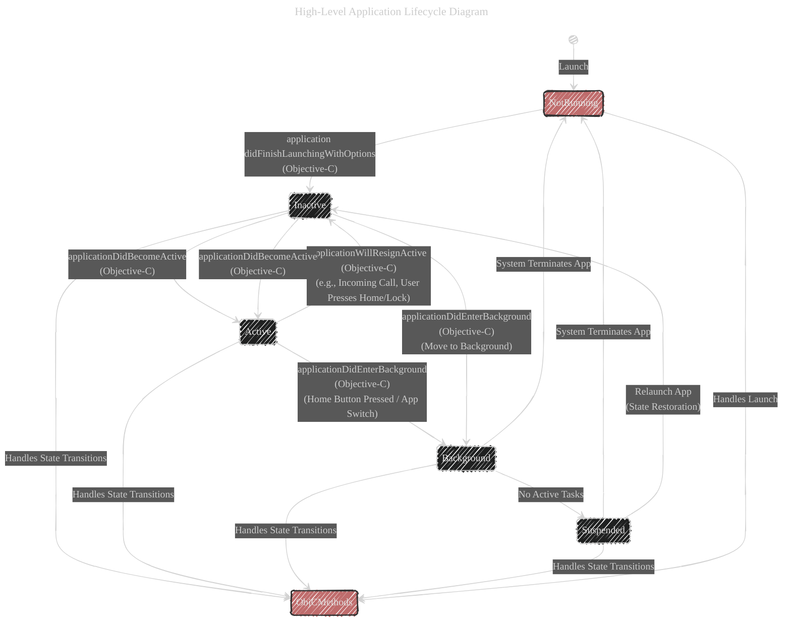

# Objective-C and UIKit Integration

---

  <blockquote>
  As a visual learner student, I created these personal study notes from the cited source(s) to aid my understanding. 
  While my firm intention is to provide full credit, the blended format of notes and diagrams may sometimes obscure the original source, for which I apologize. 
  I am committed to making corrections and welcome any feedback. 
  This is a non-commercial project for my humble educational purposes only since the start. 
  My goal is to share my perspective and contribute to the great work already being done.
   
   
  I want to extend my genuine apologies to the creators of the original materials. 
  Their work was the direct inspiration for this project, and I adapted it without first reaching out. 
  My intent comes from a place of deep respect, and I hope this is received in the spirit of homage. 
  🙏🏼🙏🏼🙏🏼🙏🏼
  </blockquote>

----

---

## High-Level Application Lifecycle Diagram

This diagram captures the overarching states of an iOS application managed primarily by UIKit, with explicit inclusion of **Objective-C delegate methods** and the **bridging between Objective-C and Swift**.

### Key Enhancements

1. **Objective-C Delegate Methods:**
    - **`application:didFinishLaunchingWithOptions:`** : Called when the app has finished launching. Typically used for initial setup.
    - **`applicationDidBecomeActive:`** : Invoked when the app moves from inactive to active state.
    - **`applicationWillResignActive:`** : Called when the app is about to move from active to inactive state.
    - **`applicationDidEnterBackground:`** : Triggered when the app enters the background.
    - **`applicationWillTerminate:`** : Optional method called when the app is about to terminate.
2. **Bridging Objective-C and Swift:**
    - **`@UIApplicationMain`** attribute in Swift bridges to the Objective-C `UIApplicationDelegate` methods.
    - When using SwiftUI with UIKit lifecycle methods, Objective-C bridge methods handle the application states.

### Explanation of Enhancements

- **Objective-C Methods Integration:** The diagram now explicitly shows how Objective-C `UIApplicationDelegate` methods correspond to state transitions. This is crucial for applications that still leverage UIKit’s delegate pattern alongside SwiftUI.
- **Bridging Mechanism:** The `ObjCMethods` node represents the collection of Objective-C delegate methods that manage state transitions. This bridge ensures that even in a SwiftUI environment, the traditional Objective-C lifecycle methods are recognized and handled appropriately.

---
**Licenses:**

- **MIT License:**   - Full text in [LICENSE](LICENSE) file.
- **Creative Commons Attribution 4.0 International:**  - Legal details in [LICENSE-CC-BY](LICENSE-CC-BY) and at [Creative Commons official site](http://creativecommons.org/licenses/by/4.0/).

---

