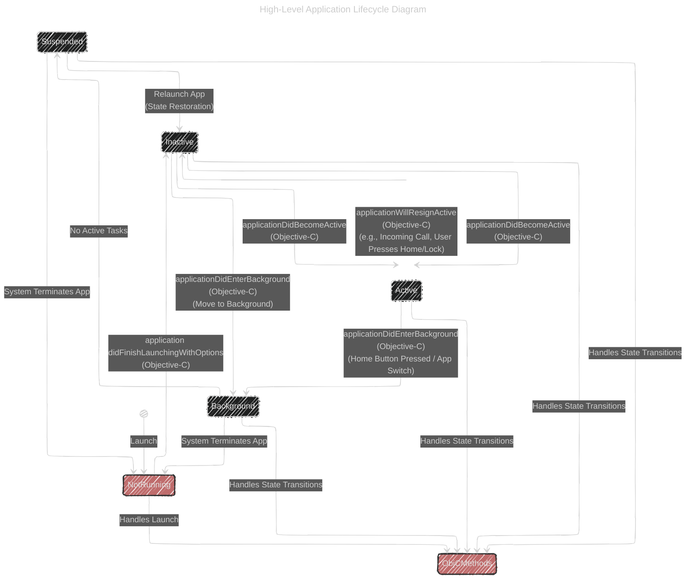

# Objective-C and UIKit Integration

> This content is dual-licensed under your choice of the following licenses:
> 1.  **MIT License:** For the code implementations in Swift and Mermaid provided in this document.
> 2.  **Creative Commons Attribution 4.0 International License (CC BY 4.0):** For all other content, including the text, explanations, and the Mermaid diagrams and illustrations.

---

## High-Level Application Lifecycle Diagram

This diagram captures the overarching states of an iOS application managed primarily by UIKit, with explicit inclusion of **Objective-C delegate methods** and the **bridging between Objective-C and Swift**.

### Key Enhancements

1. **Objective-C Delegate Methods:**
    - **`application:didFinishLaunchingWithOptions:`** : Called when the app has finished launching. Typically used for initial setup.
    - **`applicationDidBecomeActive:`** : Invoked when the app moves from inactive to active state.
    - **`applicationWillResignActive:`** : Called when the app is about to move from active to inactive state.
    - **`applicationDidEnterBackground:`** : Triggered when the app enters the background.
    - **`applicationWillTerminate:`** : Optional method called when the app is about to terminate.
2. **Bridging Objective-C and Swift:**
    - **`@UIApplicationMain`** attribute in Swift bridges to the Objective-C `UIApplicationDelegate` methods.
    - When using SwiftUI with UIKit lifecycle methods, Objective-C bridge methods handle the application states.

### Explanation of Enhancements

- **Objective-C Methods Integration:** The diagram now explicitly shows how Objective-C `UIApplicationDelegate` methods correspond to state transitions. This is crucial for applications that still leverage UIKit’s delegate pattern alongside SwiftUI.
- **Bridging Mechanism:** The `ObjCMethods` node represents the collection of Objective-C delegate methods that manage state transitions. This bridge ensures that even in a SwiftUI environment, the traditional Objective-C lifecycle methods are recognized and handled appropriately.

---
**Licenses:**

- **MIT License:**   - Full text in [LICENSE](LICENSE) file.
- **Creative Commons Attribution 4.0 International:**  - Legal details in [LICENSE-CC-BY](LICENSE-CC-BY) and at [Creative Commons official site](http://creativecommons.org/licenses/by/4.0/).

---

