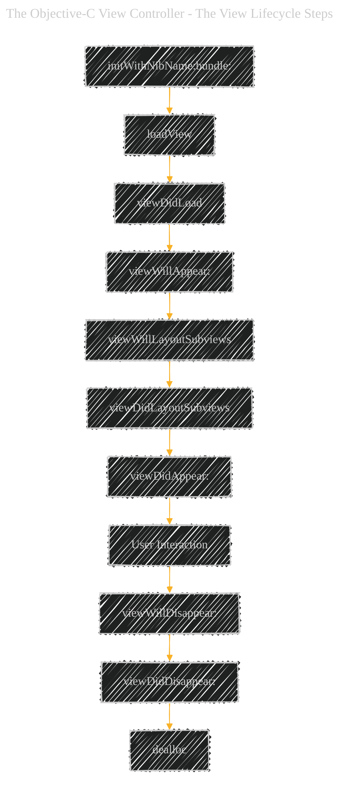

# The Objective-C View Controller - The standalone view controller

---

  <blockquote>
  As a visual learner student, I created these personal study notes from the cited source(s) to aid my understanding. 
  While my firm intention is to provide full credit, the blended format of notes and diagrams may sometimes obscure the original source, for which I apologize. 
  I am committed to making corrections and welcome any feedback. 
  This is a non-commercial project for my humble educational purposes only since the start. 
  My goal is to share my perspective and contribute to the great work already being done.
   
   
  I want to extend my genuine apologies to the creators of the original materials. 
  Their work was the direct inspiration for this project, and I adapted it without first reaching out. 
  My intent comes from a place of deep respect, and I hope this is received in the spirit of homage. 
  🙏🏼🙏🏼🙏🏼🙏🏼
  </blockquote>

----

### Explanation of the View Lifecycle Steps:

1. **`initWithNibName:bundle:`**
    - Initializes the view controller with a nib file and bundle.
2. **`loadView`**
    - Loads or creates a view hierarchy programmatically.
3. **`viewDidLoad`**
    - Called after the view has been loaded. Suitable for additional setup after loading the view.
4. **`viewWillAppear:`**
    - Invoked just before the view is added to the app’s view hierarchy.
5. **`viewWillLayoutSubviews`**
    - Called before the view lays out its subviews. Ideal for making changes before layout.
6. **`viewDidLayoutSubviews`**
    - Called after the view lays out its subviews. Suitable for additional layout adjustments.
7. **`viewDidAppear:`**
    - Invoked after the view has been added to the view hierarchy. Good for starting animations or tracking view appearance.
8. **`User Interaction`**
    - Represents the period where the user interacts with the view.
9. **`viewWillDisappear:`**
    - Called just before the view is removed from the view hierarchy.
10. **`viewDidDisappear:`**
    - Invoked after the view has been removed from the view hierarchy. Suitable for stopping services that don’t need to run when the view isn’t visible.
11. **`dealloc`**
    - Called when the view controller is about to be deallocated. Used for cleanup tasks.

### Additional Tips:

- **Debugging Lifecycle Issues:**
    - Understanding the lifecycle is crucial for debugging issues related to view loading, memory management, and resource handling.
- **Best Practices:**
    - **`viewDidLoad`:** Ideal for initializing data structures, setting up observers, and preparing the UI.
    - **`viewWillAppear:` and `viewDidAppear:`:** Useful for starting animations, network requests, or tracking analytics.
    - **`viewWillDisappear:` and `viewDidDisappear:`:** Good for saving state, stopping services, or cleaning up resources.
- **Memory Management:**
    - Ensure that you manage memory effectively in `dealloc` to prevent memory leaks, especially when dealing with observers or notifications.

This diagram serves as a quick reference to understand the sequence and purpose of each method in the Objective-C view controller lifecycle, aiding in better application architecture and maintenance.

---
**Licenses:**

- **MIT License:**   - Full text in [LICENSE](LICENSE) file.
- **Creative Commons Attribution 4.0 International:**  - Legal details in [LICENSE-CC-BY](LICENSE-CC-BY) and at [Creative Commons official site](http://creativecommons.org/licenses/by/4.0/).

---
