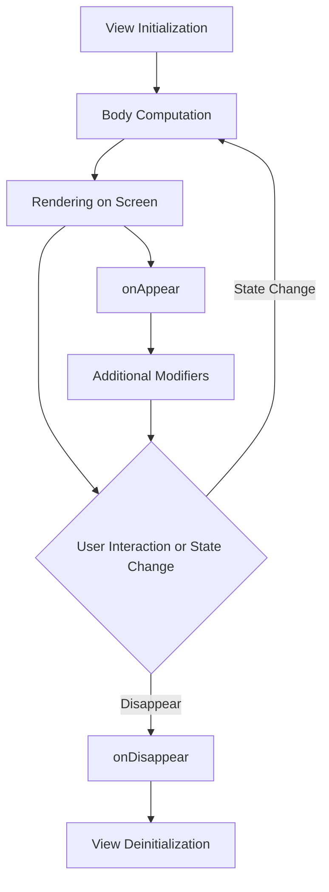

# SwiftUI View lifecycle - The standalone view

```mermaid
flowchart TD
    A[View Initialization] --> B[Body Computation]
    B --> C[Rendering on Screen]
    C --> D{User Interaction or State Change}
    D -->|State Change| B
    D -->|Disappear| E[onDisappear]
    C --> F[onAppear]
    E --> G[View Deinitialization]
    F --> H[Additional Modifiers]
    H --> D

```

---
