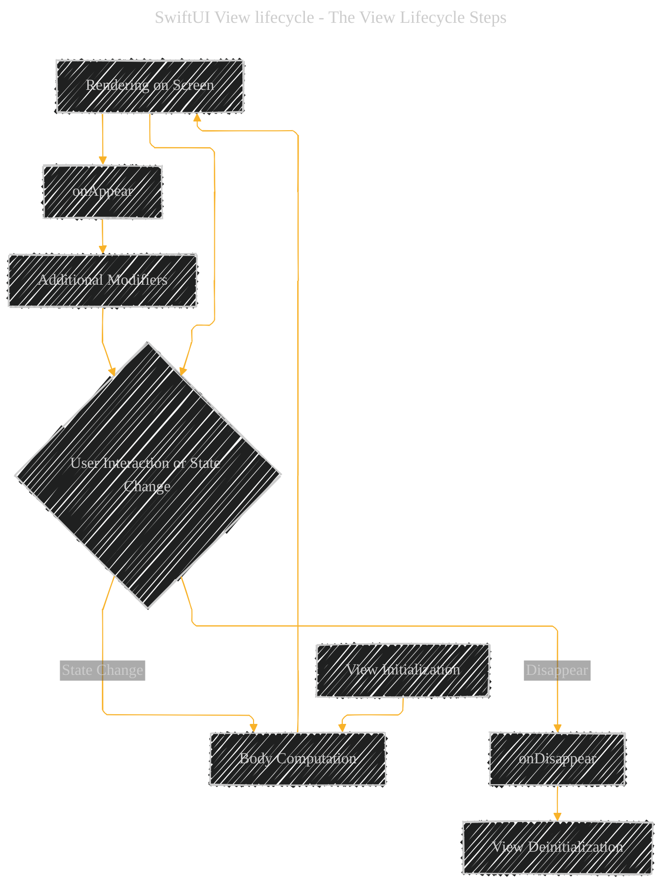

# SwiftUI View lifecycle - The standalone view
 
> This content is dual-licensed under your choice of the following licenses:
> 1.  **MIT License:** For the code implementations in Swift and Mermaid provided in this document.
> 2.  **Creative Commons Attribution 4.0 International License (CC BY 4.0):** For all other content, including the text, explanations, and the Mermaid diagrams and illustrations.

---

Below is a **Mermaid** diagram that illustrates the **SwiftUI View Lifecycle** along with related functions. This diagram provides a visual representation of the key stages and methods involved in the lifecycle of a SwiftUI view.

### Explanation of the Diagram:

1. **View Initialization (`init`)**
    - The lifecycle begins with the initialization of the SwiftUI view.
2. **Body Computation (`body`)**
    - SwiftUI calls the `body` property to compute the view's layout and contents.
3. **Rendering on Screen**
    - The computed body is rendered on the device's screen.
4. **User Interaction or State Change**
    - The view waits for user interactions or state changes that might trigger updates.
5. **State Change Handling**
    - If there's a state change, SwiftUI recomputes the `body`, leading back to re-rendering.
6. **`onAppear` Modifier**
    - Called when the view appears on the screen. Useful for tasks like fetching data.
7. **`onDisappear` Modifier**
    - Invoked when the view is about to disappear from the screen. Ideal for cleanup tasks.
8. **Additional Modifiers**
    - Other modifiers can be applied to the view, affecting its behavior and appearance.
9. **View Deinitialization (`deinit`)**
    - Finally, when the view is no longer needed, it gets deinitialized.

### Related Functions and Modifiers:

- **`init`**
    - Initializes the view instance.
- **`body`**
    - Computes and returns the view hierarchy.
- **`onAppear`**
    - Executes a closure when the view appears.
- **`onDisappear`**
    - Executes a closure when the view disappears.
- **State Modifiers (`@State`, `@Binding`, etc.)**
    - Manage and react to changes in state data.
- **`viewDidLoad`, `viewWillAppear`, `viewDidDisappear`**
    - While more common in UIKit, understanding their equivalents in SwiftUI helps bridge concepts.

---
**Licenses:**

- **MIT License:**   - Full text in [LICENSE](LICENSE) file.
- **Creative Commons Attribution 4.0 International:**  - Legal details in [LICENSE-CC-BY](LICENSE-CC-BY) and at [Creative Commons official site](http://creativecommons.org/licenses/by/4.0/).

---
