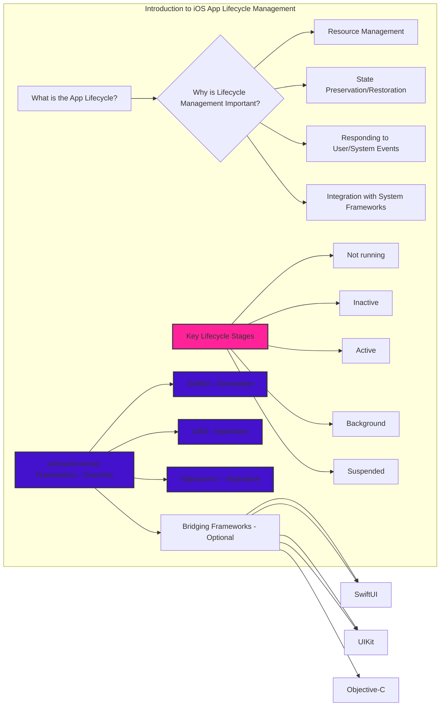

## The iOS App Lifecycle Management Overview

```mermaid
graph LR
    subgraph "Introduction to iOS App Lifecycle Management"
        A[What is the App Lifecycle?] --> B{Why is Lifecycle Management Important?}
        B --> C[Resource Management]
        B --> D[State Preservation/Restoration]
        B --> E[Responding to User/System Events]
        B --> F[Integration with System Frameworks]

        G[Key Lifecycle Stages] --> G1[Not running]
        G --> G2[Inactive]
        G --> G3[Active]
        G --> G4[Background]
        G --> G5[Suspended]


        H[Lifecycle Across Frameworks - Overview] --> H1[SwiftUI - Declarative]
        H --> H2[UIKit - Imperative]
        H --> H3[Objective-C - Imperative]

        H --> I[Bridging Frameworks - Optional]
    end

    I --> SwiftUI & UIKit
    I --> SwiftUI & UIKit & Objective-C

    style G fill:#f29f,stroke:#333,stroke-width:2px
    style H fill:#41cf,stroke:#333,stroke-width:2px

    classDef Frameworks fill:#41cf,stroke:#333,stroke-width:2px
    class H1,H2,H3 Frameworks

```

---
