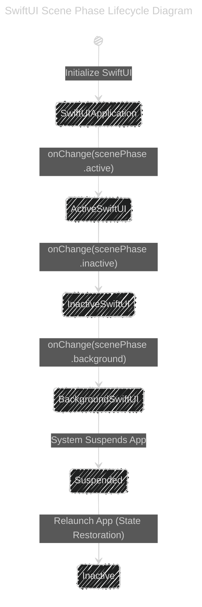

```mermaid
---
title: iOS Application Lifecycle - UIKit
config:
  layout: elk
  look: handDrawn
  theme: dark
---
graph LR
    subgraph "iOS Application Lifecycle (UIKit)"
        NotRunning["Not Running"]:::lifecycleStarts --> AppLaunch["App Launches"]:::UIKitProcess
        AppLaunch --> didFinishLaunching["didFinishLaunchingWithOptions()"]:::UIKitProcess
        didFinishLaunching --> appDidBecomeActive["applicationDidBecomeActive()"]:::UIKitProcess
        appDidBecomeActive --> Active["Active"]:::lifecycleActive

        Active -- "User Action (Home/Lock),\\nIncoming Call" --> willResignActive["applicationWillResignActive()"]:::UIKitProcess
        willResignActive --> didEnterBackground["applicationDidEnterBackground()"]:::UIKitProcess
        didEnterBackground --> Background["Background"]:::lifecycleActive

        Background -- "User Reopens App,\\nSystem Promotes App" --> willEnterForeground["applicationWillEnterForeground()"]:::UIKitProcess
        willEnterForeground --> appDidBecomeActive
        Background -- "System Memory Pressure" --> Suspended["Suspended"]:::lifecycleActive
        Suspended -- "User Relaunches App" --> didFinishLaunching
        Background -- "User/System Termination"  --> willTerminate["applicationWillTerminate()"]:::UIKitProcess

         willTerminate --> Terminated["Terminated"]:::lifecycleEnds

        subgraph "Scene Delegate Lifecycle (UIKit)"
            Active --> SceneDidBecomeActive["sceneDidBecomeActive()"]:::UIKitProcess
           SceneDidBecomeActive --> Active
            SceneWillResignActive["sceneWillResignActive()"]:::UIKitProcess --> willResignActive
            SceneDidEnterBackground["sceneDidEnterBackground()"]:::UIKitProcess --> didEnterBackground
            SceneWillEnterForeground["sceneWillEnterForeground()"]:::UIKitProcess --> willEnterForeground
            SceneDidDisconnect["sceneDidDisconnect()"]:::UIKitProcess --> Terminated

        end
    end


    subgraph "SwiftUI View Lifecycle"
        Active --> ViewAppear["View.onAppear()"]:::SwiftUIProcess
        ViewAppear --> refreshBody["View.body recomputes"]:::SwiftUIProcess
        ViewAppear --> ViewDisappear["View.onDisappear()"]:::SwiftUIProcess
        refreshBody --> ViewAppear
         ViewDisappear --> refreshBody

    end



    classDef lifecycleStarts fill:#6c8ebf,stroke:#333,stroke-width:2px,roundedCorners, color:#ffffff
    classDef lifecycleEnds fill:#bf6c6c,stroke:#333,stroke-width:2px,roundedCorners, color:#ffffff
    classDef lifecycleActive fill:#6bbf6c,stroke:#333,stroke-width:2px,roundedCorners, color:#000000
    classDef UIKitProcess fill:#FF6666,stroke:#333,stroke-width:2px,roundedCorners, color:#ffffff
    classDef SwiftUIProcess fill:#FFC0CB,stroke:#333,stroke-width:2px,roundedCorners, color:#000000

```

# Overview of the iOS app lifecycle using UIKit and SwiftUI frameworks

> This content is dual-licensed under your choice of the following licenses:
> 1.  **MIT License:** For the code implementations in Swift and Mermaid provided in this document.
> 2.  **Creative Commons Attribution 4.0 International License (CC BY 4.0):** For all other content, including the text, explanations, and the Mermaid diagrams and illustrations.

---

---

another overview diagram version:

---

Conveying the complexity of the iOS application lifecycle, especially when integrating both UIKit and SwiftUI components, can be effectively achieved by utilizing a **set of interconnected diagrams**. This approach allows for a modular understanding, where each diagram focuses on a specific aspect of the lifecycle, and together they provide a comprehensive overview.

Below, I present **three distinct Mermaid diagrams**:

1. **High-Level Application Lifecycle Diagram**
2. **SwiftUI Scene Phase Lifecycle Diagram**
3. **SwiftUI View Lifecycle Diagram**
4. **iOS app lifecycle with multiple scenes in various states**

Each diagram highlights different facets of the lifecycle, and their interconnections are explained to provide a holistic understanding.

## 1. High-Level Application Lifecycle Diagram

This diagram captures the overarching states of an iOS application managed primarily by UIKit. It outlines how the app transitions between different states from launch to termination.

### **Key States Explained:**

- **Not Running:** The app is not launched or has been terminated.
- **Inactive:** The app is running in the foreground but not receiving events (e.g., during transitions).
- **Active:** The app is running in the foreground and receiving events.
- **Background:** The app is in the background and executing code.
- **Suspended:** The app is in the background but not executing code.

---

## 2. SwiftUI Scene Phase Lifecycle Diagram

SwiftUI introduces the concept of **scene phases**, which align with the app's lifecycle states but are managed within the SwiftUI framework. This diagram illustrates how SwiftUI observes and responds to changes in the app's scene phase.

### **Scene Phases Explained:**

- **ActiveSwiftUI:** Corresponds to the app being in the foreground and active.
- **InactiveSwiftUI:** Corresponds to transient states where the app is not receiving events.
- **BackgroundSwiftUI:** Corresponds to the app running in the background.
- **Suspended:** Maintains consistency with the high-level lifecycle.

---

## 3. SwiftUI View Lifecycle Diagram

This diagram focuses on the lifecycle of individual SwiftUI views within the active application state. It showcases how views appear, disappear, and update in response to state changes.

### **View Lifecycle Events Explained:**

- **MainView.onAppear():** Triggered when `MainView` appears on the screen.
- **MainView.onDisappear():** Triggered when `MainView` disappears from the screen.
- **DetailView.onAppear():** Triggered when `DetailView` appears.
- **DetailView.onDisappear():** Triggered when `DetailView` disappears.
- **body recomputes:** Indicates that the view's body is being re-rendered, often due to state changes.

## 4. The iOS application lifecycle with multiple scenes in various states

### Diagram Explanation

1. **States:**
    - **Not Running:** The app is not launched or has been terminated.
    - **Inactive:** The app is in the foreground but not receiving events (e.g., during an interruption like a phone call).
    - **Active:** The app is in the foreground and receiving events.
    - **Background:** The app is executing code in the background.
    - **Suspended:** The app is in the background but not executing code.
2. **Transitions:**
    - **Launch:** When the app is launched, it moves from **Not Running** to **Inactive**, then to **Active**.
    - **Interruptions:** An active app can become **Inactive** due to interruptions (like incoming calls), and then either return to **Active** or move to **Background**.
    - **Home Button Press/App Switch:** Moves the app from **Active** to **Background**.
    - **Termination:** The system can terminate the app from the **Background** or **Suspended** state, moving it to **Not Running**.
    - **SwiftUI Lifecycle:** Represents the modern lifecycle management using the `@main` App protocol and `scenePhase`.
3. **SwiftUI Specifics:**
    - Uses the `@main` App protocol to manage lifecycle states with `scenePhase`.
    - Transitions include **ActiveSwiftUI**, **InactiveSwiftUI**, and **BackgroundSwiftUI** corresponding to the `scenePhase` changes.
4. **Multiple Scenes:**
    - Illustrates support for multiple UI windows (scenes) within the same app, each managing its own lifecycle independently.
5. **State Restoration:**
    - Allows the app to restore its state when relaunched from the **Suspended** state.

---

## Integrating the Diagrams

To grasp the full picture of the iOS application lifecycle with both UIKit and SwiftUI components, it's essential to understand how these diagrams interrelate:

1. **Application Lifecycle ↔️ SwiftUI Scene Phases:**
    - The **High-Level Application Lifecycle** manages the broad states of the app.
    - **SwiftUI Scene Phases** observe these states and allow SwiftUI views to respond accordingly.
    - For example, when the app transitions to `Active`, `ActiveSwiftUI` is triggered, which in turn can initiate view updates.
2. **SwiftUI Scene Phases ↔️ SwiftUI View Lifecycle:**
    - **SwiftUI Scene Phases** affect the **SwiftUI View Lifecycle** by invoking lifecycle methods like `onAppear()` and `onDisappear()` based on scene phase changes.
    - For instance, when `ActiveSwiftUI` is entered, `MainView.onAppear()` is called to set up the view.
3. **High-Level Lifecycle ↔️ SwiftUI View Lifecycle:**
    - Changes in the **High-Level Lifecycle** (e.g., moving to `Background`) can lead to view updates, such as views disappearing or state being saved.
    - The **Suspended** state might trigger `MainView.onDisappear()` to release resources or save state.

---

## Visual Summary

To visualize the interplay between these diagrams, consider the following flow:

1. **App Launch:**
    - **High-Level Lifecycle:** `[ * ]` ➔ `NotRunning` ➔ `Inactive` ➔ `Active`
    - **SwiftUI Scene Phases:** `SwiftUIApplication` ➔ `ActiveSwiftUI`
    - **SwiftUI View Lifecycle:** `Active` ➔ `MainView.onAppear()`
2. **Receiving an Interrupt (e.g., Phone Call):**
    - **High-Level Lifecycle:** `Active` ➔ `Inactive`
    - **SwiftUI Scene Phases:** `ActiveSwiftUI` ➔ `InactiveSwiftUI`
    - **SwiftUI View Lifecycle:** `MainView.onDisappear()`
3. **Moving to Background:**
    - **High-Level Lifecycle:** `Inactive` ➔ `Background`
    - **SwiftUI Scene Phases:** `InactiveSwiftUI` ➔ `BackgroundSwiftUI`
    - **SwiftUI View Lifecycle:** `MainView.onDisappear()`
4. **App Termination:**
    - **High-Level Lifecycle:** `Background` ➔ `NotRunning`
    - **SwiftUI Scene Phases:** Transition to `[ * ]`
    - **SwiftUI View Lifecycle:** N/A (App is terminating)

---

## Benefits of Using Multiple Diagrams

- **Modularity:** Each diagram focuses on a specific aspect, making it easier to understand complex relationships without being overwhelmed.
- **Clarity:** Separating concerns (application states, scene phases, view lifecycles) avoids clutter and enhances comprehension.
- **Flexibility:** Developers can reference the relevant diagram based on the aspect they are working on or troubleshooting.
- **Depth:** Allows for detailed exploration of each lifecycle component without sacrificing the overview provided by other diagrams.

---

## Additional Considerations

- **State Synchronization:** Ensure that SwiftUI's scene phases remain synchronized with the high-level application lifecycle states to prevent inconsistencies.
- **Lifecycle Methods:** Familiarize yourself with both UIKit and SwiftUI lifecycle methods to manage transitions effectively.
- **Testing Transitions:** Use these diagrams as a guide to test and debug application state transitions, ensuring that views respond appropriately to lifecycle changes.
- **Performance Optimization:** Understanding the lifecycle helps in optimizing resource management during state transitions, especially when moving to the background or being suspended.

---
**Licenses:**

- **MIT License:**   - Full text in [LICENSE](LICENSE) file.
- **Creative Commons Attribution 4.0 International:**  - Legal details in [LICENSE-CC-BY](LICENSE-CC-BY) and at [Creative Commons official site](http://creativecommons.org/licenses/by/4.0/).

---