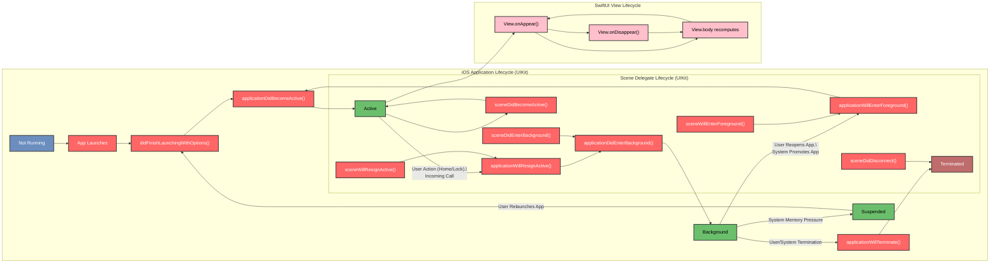

# iOS app lifecycle using UIKit and SwiftUI frameworks

```mermaid
graph LR
    subgraph "iOS Application Lifecycle (UIKit)"
        NotRunning["Not Running"]:::lifecycleStarts --> AppLaunch["App Launches"]:::UIKitProcess
        AppLaunch --> didFinishLaunching["didFinishLaunchingWithOptions()"]:::UIKitProcess
        didFinishLaunching --> appDidBecomeActive["applicationDidBecomeActive()"]:::UIKitProcess
        appDidBecomeActive --> Active["Active"]:::lifecycleActive

        Active -- "User Action (Home/Lock),\\nIncoming Call" --> willResignActive["applicationWillResignActive()"]:::UIKitProcess
        willResignActive --> didEnterBackground["applicationDidEnterBackground()"]:::UIKitProcess
        didEnterBackground --> Background["Background"]:::lifecycleActive

        Background -- "User Reopens App,\\nSystem Promotes App" --> willEnterForeground["applicationWillEnterForeground()"]:::UIKitProcess
        willEnterForeground --> appDidBecomeActive
        Background -- "System Memory Pressure" --> Suspended["Suspended"]:::lifecycleActive
        Suspended -- "User Relaunches App" --> didFinishLaunching
        Background -- "User/System Termination"  --> willTerminate["applicationWillTerminate()"]:::UIKitProcess

         willTerminate --> Terminated["Terminated"]:::lifecycleEnds

        subgraph "Scene Delegate Lifecycle (UIKit)"
            Active --> SceneDidBecomeActive["sceneDidBecomeActive()"]:::UIKitProcess
           SceneDidBecomeActive --> Active
            SceneWillResignActive["sceneWillResignActive()"]:::UIKitProcess --> willResignActive
            SceneDidEnterBackground["sceneDidEnterBackground()"]:::UIKitProcess --> didEnterBackground
            SceneWillEnterForeground["sceneWillEnterForeground()"]:::UIKitProcess --> willEnterForeground
            SceneDidDisconnect["sceneDidDisconnect()"]:::UIKitProcess --> Terminated

        end
    end


    subgraph "SwiftUI View Lifecycle"
        Active --> ViewAppear["View.onAppear()"]:::SwiftUIProcess
        ViewAppear --> refreshBody["View.body recomputes"]:::SwiftUIProcess
        ViewAppear --> ViewDisappear["View.onDisappear()"]:::SwiftUIProcess
        refreshBody --> ViewAppear
         ViewDisappear --> refreshBody

    end


    classDef lifecycleStarts fill:#6c8ebf,stroke:#333,stroke-width:2px,roundedCorners, color:#ffffff
    classDef lifecycleEnds fill:#bf6c6c,stroke:#333,stroke-width:2px,roundedCorners, color:#ffffff
    classDef lifecycleActive fill:#6bbf6c,stroke:#333,stroke-width:2px,roundedCorners, color:#000000
    classDef UIKitProcess fill:#FF6666,stroke:#333,stroke-width:2px,roundedCorners, color:#ffffff
    classDef SwiftUIProcess fill:#FFC0CB,stroke:#333,stroke-width:2px,roundedCorners, color:#000000

```

---

